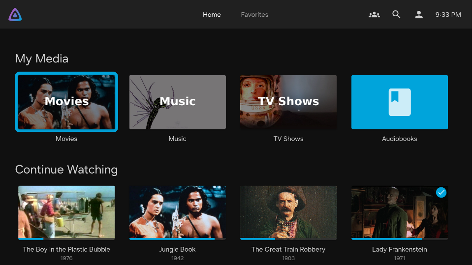

# Languages

## Change the language

- To change the language, go to the Home page.
- Click on the user icon in the top right corner.
- On the Settings page that opens, click on "Display".
- On the now opened Display settings page, under the section "Localization" use the "Display language" dropdown to select a different language.
- Scroll down to the bottom of the Display settings page and click on "Save".
- After a short moment the new language settings should be applied.

## Supported languages

The Jellyfin app supports language auto detection and the following languages:
- Afrikaans (af)
- العربية (ar)
- Беларуская (be-BY)
- Български (bg-BG)
- বাংলা (বাংলাদেশ) (bn_BD)
- Català (ca)
- Čeština (cs)
- Cymraeg (cy)
- Dansk (da)
- Deutsch (de)
- Ελληνικά (el)
- English (United Kingdom) (en-GB)
- English (en-US)
- Esperanto (eo)
- Español (es)
- Español americano (es_419)
- Español (Argentina) (es-AR)
- Español (Dominicana) (es_DO)
- Español (México) (es-MX)
- Eesti (et)
- Euskara (eu)
- فارسی (fa)
- Suomi (fi)
- Filipino (fil)
- Français (fr)
- Français (Canada) (fr-CA)
- Galego (gl)
- Schwiizerdütsch (gsw)
- עִבְרִית (he)
- हिन्दी (hi-IN)
- Hrvatski  (hr)
- Magyar (hu)
- Bahasa Indonesia (id)
- Íslenska (is-IS)
- Italiano (it)
- 日本語 (ja)
- Qazaqşa (kk)
- 한국어 (ko)
- Lietuvių (lt-LT)
- Latviešu (lv)
- Македонски (mk)
- മലയാളം (ml)
- मराठी (mr)
- Bahasa Melayu (ms)
- Norsk bokmål (nb)
- नेपाली (ne)
- Nederlands (nl)
- Norsk nynorsk (nn)
- ਪੰਜਾਬੀ (pa)
- Polski (pl)
- Pirate (pr)
- Português (pt)
- Português (Brasil) (pt-BR)
- Português (Portugal) (pt-PT)
- Românește (ro)
- Русский (ru)
- Slovenčina (sk)
- Slovenščina (sl-SI)
- Shqip (sq)
- Српски (sr)
- Svenska (sv)
- தமிழ் (ta)
- తెలుగు (te)
- ภาษาไทย (th)
- Türkçe (tr)
- Українська (uk)
- اُردُو (ur_PK)
- Tiếng Việt (vi)
- 汉语 (简化字) (zh-CN)
- 漢語 (繁体字) (zh-TW)
- 廣東話 (香港) (zh-HK)

## Screenshots

*Home page*

*Settings page*

*Display settings page*

*Save display settings*

